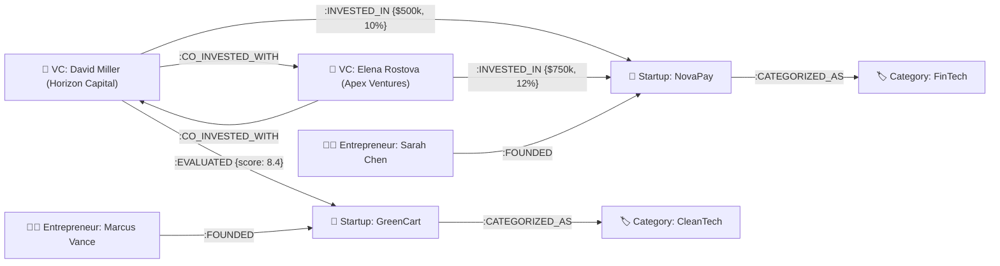

# VentureConnect 🚀
### Startup Discovery, Investment & Portfolio Management Platform with CognoDB openCypher Graph Engine

VentureConnect is a full-stack web platform connecting entrepreneurs seeking funding with venture capitalists (VCs) looking for startup investment opportunities. Built according to the **VentureConnect Product Requirements Document (PRD)** and **Wexa AI Graph Database Assignment Requirements**, it unifies the entire startup investment lifecycle into a single structured workflow: from startup profile creation, pitch deck PDF uploads, and admin verification to VC evaluation scorecards, side-by-side startup comparison, investment pipeline management, due diligence workspace, meeting scheduling, proposal negotiations, post-investment portfolio tracking, and multi-hop graph syndicate discovery.

---

## 🛠️ Technology Stack

- **Frontend**: **HTML5**, **CSS3**, **JavaScript** (ES6+ / Angular SPA), **Bootstrap 5**, Bootstrap Icons
- **Backend**: **Node.js** + **Express.js** + JWT (`jsonwebtoken`) + `bcryptjs` + `multer` (PDF pitch deck upload handler)
- **Database**: **CognoDB Cloud** / Neo4j Graph Database (openCypher over Bolt protocol via `neo4j-driver`) + MongoDB document store fallback
- **Authentication**: JWT (JSON Web Tokens) with Role-Based Access Control (`entrepreneur`, `vc`, `admin`)

---

## 📐 Graph Data Model & Diagram (Wexa AI Assignment Requirement)

### Node Labels:
- `:VC`: Venture Capitalists & Investor Profiles (e.g. David Miller - Horizon Capital, Elena Rostova - Apex Ventures)
- `:Startup`: Verified Startups (e.g. NovaPay, HealthPulse AI, GreenCart Logistics)
- `:Entrepreneur`: Founders (e.g. Sarah Chen, Marcus Vance, Priya Sharma)
- `:Category`: Industries (e.g. FinTech, HealthTech, CleanTech)

### Relationship Types:
- `(VC)-[:INVESTED_IN {amount, equity_percent, date}]->(Startup)`
- `(VC)-[:EVALUATED {overall_score}]->(Startup)`
- `(VC)-[:CO_INVESTED_WITH]->(VC)`
- `(Entrepreneur)-[:FOUNDED]->(Startup)`
- `(Startup)-[:CATEGORIZED_AS]->(Category)`



---

## 💡 "Why a Graph Database?" (Wexa AI Section)

Traditional relational and document databases struggle with multi-hop network queries like *"Find all co-investors who invested in startups within the same industry as VC X's portfolio, and identify common syndicate partners."*

In a relational database, answering 2-hop or 3-hop relationship queries requires joining multiple heavy junction tables (`users`, `startups`, `investments`, `syndicates`), resulting in exponential `$lookup` or `JOIN` latency as the dataset grows.

### Key Graph Database Advantages:
1. **Index-Free Adjacency**: Traversing a relationship (`(VC)-[:INVESTED_IN]->(Startup)<-[:INVESTED_IN]-(CoVC)`) is an `O(1)` pointer lookup, regardless of total database size.
2. **Multi-Hop Traversal**: Parameterized openCypher queries allow instant discovery of co-investment networks, lead investor syndicates, and deal referral paths.
3. **Natural Data Modeling**: Startups, Venture Capitalists, Entrepreneurs, and Categories are labeled nodes, connected by typed relationships with properties (e.g. equity %, investment round date).

---

## 🌟 Key Features (VentureConnect PRD)

### 1. 📊 VC Evaluation Scorecard (Manual 1-10 Ratings)
- Rate startups across **7 core criteria**: Market Potential, Business Model, Product, Team, Financials, Competition, and Scalability.
- Auto-calculates overall weighted score (1.0 to 10.0 scale) purely based on VC manual inputs (No AI used).

### 2. ⚖️ Side-by-Side Startup Comparison Matrix
- Compare **2 to 4 startups side-by-side** across funding required, equity offered, MRR, ARR, stage, team size, location, and evaluation scorecards.

### 3. 📈 Investment Dealflow Pipeline (Kanban Board)
- Move startups through stages: `New` → `Review` → `Shortlisted` → `Due Diligence` → `Meeting` → `Proposal` → `Negotiation` → `Invested`.

### 4. 📋 Due Diligence Workspace (% Progress Meter)
- Structured checklist spanning **Business**, **Financial**, **Legal**, and **Team** audits with live percentage completion meter (e.g. 8/10 checks completed = 80%).

### 5. 🤝 Investment Proposal & Negotiation Audit Trail
- VC issues term sheet proposals (Investment Amount, Equity %, Conditions, Notes).
- Entrepreneur can **Accept**, **Reject**, or submit **Counter-Offers**.
- Stores complete negotiation thread history for both parties.

### 6. 💼 Portfolio & Startup Progress Tracking
- Track active investments, equity %, capital invested, and post-investment quarterly progress reports (revenue, active customers, employees, milestones).

### 7. 🛡️ Admin Verification Module
- Dashboard with platform metrics (Total users, entrepreneurs, VCs, pending/approved startups, capital funded).
- Verification queue to **Approve & Publish**, **Request Correction**, or **Reject** submissions.

### 8. 🕸️ CognoDB openCypher Graph Explorer
- Multi-hop Cypher queries (`MATCH (v:VC {id: $vc_id})-[r1:INVESTED_IN]->(s:Startup)<-[r2:INVESTED_IN]-(coVC:VC) RETURN v, r1, s, r2, coVC`) for co-investor syndicate analysis.

---

## 🚀 Quick Start & Run Instructions

### 1. Run Node.js + Express Server
```bash
cd backend
npm install
npm start
```
- Node.js Express server runs at: `http://127.0.0.1:8000`
- The Express server serves both the **REST API** (`/api/*`) and the **HTML + CSS + JS + Bootstrap Web Application** at `http://127.0.0.1:8000/`!

### 2. Optional: Run Frontend Standalone Dev Server
```bash
cd frontend
npm install
npm start
```
- Frontend web app runs at: `http://localhost:4200`

---

## 🔑 Demo Account Credentials

Use the quick-fill role switcher buttons in the navbar or enter credentials directly on the login screen:

| Role | Email / Name | Password | Details |
| :--- | :--- | :--- | :--- |
| **Entrepreneur** | `sarah@novapay.io` | `password123` | Sarah Chen (NovaPay FinTech Founder) |
| **VC Investor** | `david@horizoncap.com` | `password123` | David Miller (Horizon Capital Partner) |
| **Admin** | `admin@ventureconnect.com` | `admin123` | System Administrator |
